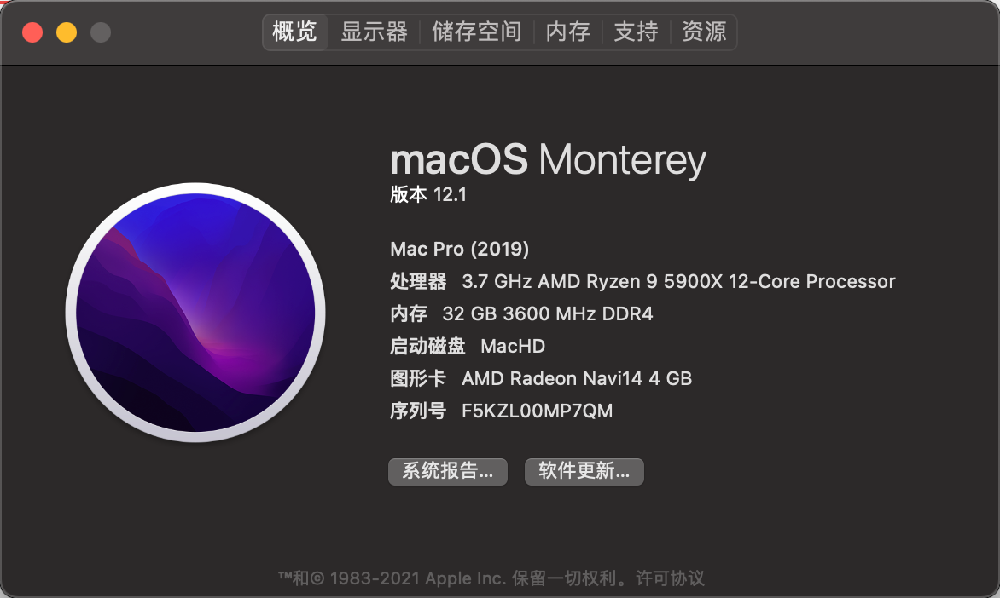
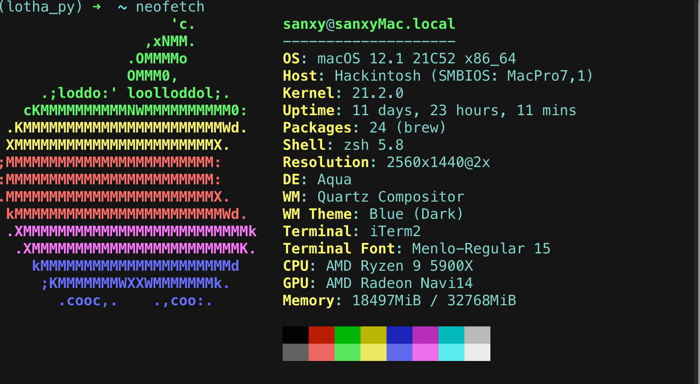
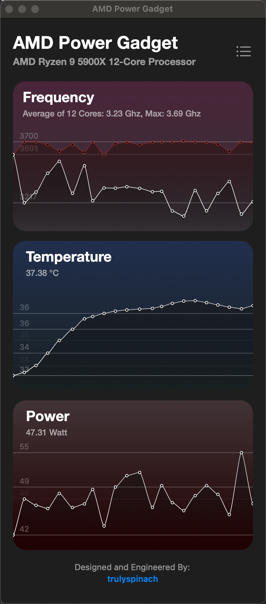
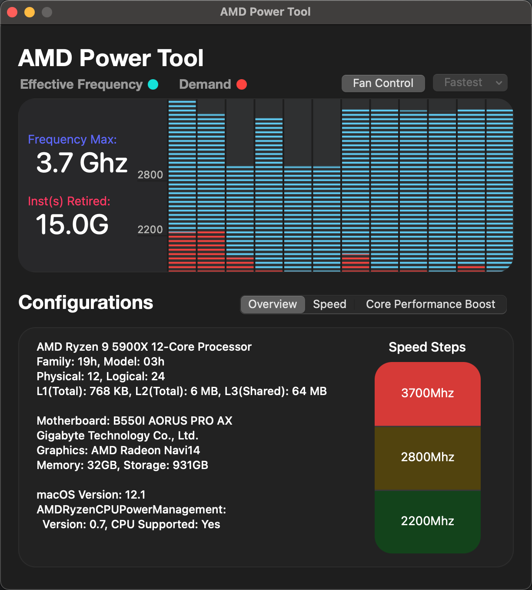

# Gigabyte-B550I-AMD-Hackintosh
Gigabyte B550I AMD Hackintosh OC 0.8.3

# Device
| **Component** | **Model** |
| ------------- | --------- |
| CPU | AMD R9-5900X |
| RAM | 32GB (2 x 16GB) DDR4 @3200MHz CL16 |
| Mobo | Gigabyte B550i Aorus Pro AX (BIOS: F12)|
| Graphics | rx5500 |
| RAM | SN770 1T |
| Power | SeaSonic SPX 750 SFX |
| Case | Lianli Bauhaus Air mini |
| CPU-Fans | Thermalright Frozen Magic 240 WHITE ARGB  |

# BIOS Setting
 - BIOS: Update to F12 version (later versions have issues with sleep)
 	- Save & Exit → Load Optimized Defaults
 	- Tweaker → Extreme Memory Profile (X.M.P) : Profile1
 	- Tweaker → Advanced CPU Settings → SVM Mode : Enabled (only if you need virtualization)
 	- Settings → Platform Power → Wake on LAN : Disabled
 	- Settings → IO Ports → USB Configuration → XHCI Hand-off : Enabled
  - Settings → IO Ports → Above 4G decoding : Enabled    ¡THIS ONE IS VERY IMPORTANT TO AVOID KERNEL PANIC AT BOOT!
  - Settings → IO Ports → Re-Size BAR Support : Auto
  - Settings → Miscellaneous → IOMMU : Disabled
 	- Boot → Fast Boot : Disabled
 	- Boot → CMS Support : Disabled
 	- Boot → Secure Boot → Secure Boot : Disabled

# Screenshot

  

# THANKS

* [https://github.com/aleixsr/Ryzentosh](https://github.com/aleixsr/Ryzentosh)
* [https://github.com/radianttap/EFI-B550I-Aorus](https://github.com/radianttap/EFI-B550I-Aorus)

